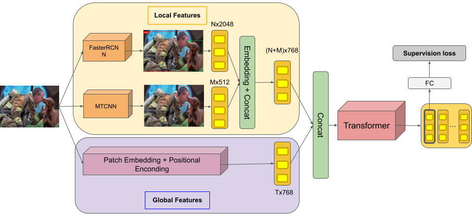

# **Visual Sentiment Analysis: A Natural Disaster Use-case**

| Some samples from the dataset.  |
|:-------------------------:|
|  |

## **Description**
The goal of this project is to analyze sentiment aspects of pictures taken in natural disaster scenarios. While these scene mostly toward negative feelings, there are visual influence appears in these images that has positive impact on the eyes of human. 

| |
|:-------------------------:|
| Figure: Statistics of crowd-sourcing study in terms of what kind of information in the images influence users's emotion most. Figure from organization's paper.  |


## **Method**
This repo contains source code for our run 1:
- In this run, we use various method to tackle the 3 tasks. Then we apply heuristic ensemble method to finalize our results. 
- Methods that are used:

Method | Pretrained model | Description
--- | --- | ---
efficientnet_b{i} (ns)[^1] | ImageNet | EfficientNet models from timm
efficientnetv2_m | ImageNet | EfficientNet-V2 model from timm
metavit | ImageNet | Vision Transformer with extracted meta features
 
[^1]: NoisyStudent

| |  |
|:-------------------------:|:-------------------------:|
| Augmentation methods | Metadata |


- In order to deal with imbalance dataset, which is the main problem of the task, we apply following methods:
    - Focal Loss for task 1. 
    - Strong data augmentation techniques such as RandAugment, CutMix, MixUp to add more training samples. 
    - Smart sampling technique - split labels equally into batches so that all classes are evenly distributed for each batch.

- The other tasks which are multilabel classification therefore Binary Cross Entropy with Sigmoid function is used.

## Pipeline

| |  |
|:-------------------------:|:-------------------------:|
| MetaVIT | Ensemble |


- In the metavit method, we introduce more complex pipeline:
    - First, facenet model ise used to extract facial features from all samples in the dataset. Due to our observation, we observe that ```positive``` and ```neutral``` samples are mostly based on the emotion of people within the scene, so the extracted features may contains helpful information.

    - Second, as can be seen in figure above, visible objects in the scene also affect the feelings of the observer, thus we inherit FasterRCNN model to extract bottom-up attention features as additional information.

    - Then, for each samples, two meta features are concatenated then forwarded through a pretrained Vision Transformer, implementation from timm.

- To ensemble all our models, we perform majority votes technique from prediction of these models.

## **Results**

**Weighted F1-Score is used as metric evaluation**

- Evalution on our valset:

Method | Task-1 | Task-2  | Task-3
--- | --- | --- | --- 
efficientnet_b5 | 0.6839 | 0.674 | 0.54
efficientnet_b5_ns | 0.722 | 0.68 | 0.527
efficientnet_b6_ns | 0.684 | 0.669 | 0.5258
efficientnetv2_m | 0.709 | 0.6764 | 0.5394
metavit | 0.705 | 0.661 | 0.532
ensemble | 0.733 | 0.646 | 0.5

- Final results on testset:

Team-run | Task-1 | Task-2 | Task-3
--- | --- | --- | --- 
SELAB-HCMUS khoi_submission/run1 | 0.722 |0.605 | 0.584

## Working note
- Our working note: [HCMUS at MediaEval 2021: Efficient methods of Metadata
Embedding and Augmentation for Visual Sentiment Analysis](./assets/_Visual_Sentiment_Task_MediaEval___2021___HCMUS_.pdf)


## **Notebooks**

- Extract Face Embeddings using MTCNN. [](https://colab.research.google.com/drive/1n2yVITUdTzNXHvAdPgpbYjVgh8zXDEg6?usp=sharing)

- Faster-RCNN Bottom-Up Attention. [](https://colab.research.google.com/drive/1xC4mVc_bp0t4-7T4xVum3AECFCalsgsv?usp=sharing)

- Training/Evalution/Inference notebooks [](https://colab.research.google.com/drive/1A5ZDwFZwAdsjnU-mGaCl_yvQY4QCpg9f?usp=sharing)

## **Code References**

- https://github.com/rwightman/pytorch-image-models
- https://github.com/timesler/facenet-pytorch
- https://github.com/airsplay/py-bottom-up-attention

## **Paper references**

```
@misc{hassan2020visual,
      title={Visual Sentiment Analysis from Disaster Images in Social Media}, 
      author={Syed Zohaib Hassan and Kashif Ahmad and Steven Hicks and Paal Halvorsen and Ala Al-Fuqaha and Nicola Conci and Michael Riegler},
      year={2020},
      eprint={2009.03051},
      archivePrefix={arXiv},
      primaryClass={cs.CV}
}
```

```
@inproceedings{hassan2021vissentiment,
  title={Visual Sentiment Analysis: A Natural Disaster Use-case Task at MediaEval 2021},
  author={Hassan, Syed Zohaib and  Ahmad, Kashif and Riegler, Michael and Hicks, Steven  and  Conci, Nicola, and Halvorsen, Pal and  Al-Fuqaha, Ala},
  booktitle={Proceedings of the MediaEval 2021 Workshop, Online},
  year={2021}
}
```
